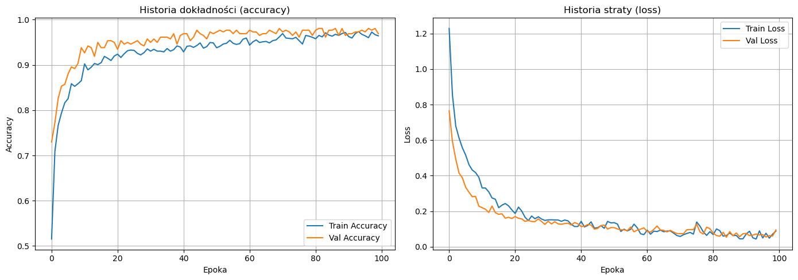
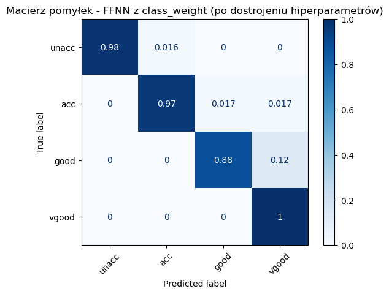

# 🧠 Computational intelligence 🧠

### Authors: Jakub Figura, Jakub Dragosz, Bartosz Bochniak, Joanna Szewczyk

This repository contains solutions form Computational Intelligence course on Jagiellonian University.
# Table of Contents

1. [FFNN](#Feed_Forward_Neural_Network)
2. [SOM](#Self_organising_map)

 

# Feed Forward Neural Network

Experiments with FFNN on dataset Nursery: Rajkovic, V. (1989). Nursery [Dataset]. UCI Machine Learning Repository. https://doi.org/10.24432/C5P88W.
 

[FFNN](https://github.com/jakubfigura/computational_intelligence/blob/main/project/ffnn.ipynb)
 

 

# Self organising map

Experiments with SOM on dataset Nursery: Rajkovic, V. (1989). Nursery [Dataset]. UCI Machine Learning Repository. https://doi.org/10.24432/C5P88W.

# Comparison of Methods: SOM vs FFNN

| Aspect | SOM (Cars - Unsupervised) | FFNN (Cars - Supervised) |
| :--- | :--- | :--- |
| **Goal** | Data Exploration & Clustering | Classification (Prediction) |
| **Primary Metric** | `Topographic Error`: **0.0446** | `Accuracy`: **97.69%** |
| **Secondary Metric** | `Quantization Error`: **0.6741** | `F1-Score`: **0.98** |
| **Conclusion** | Data preserves topological structure. | Model is stable and highly precise. |
| **Application** | Visualization and analysis of car groups. | Automated decision-making. |
